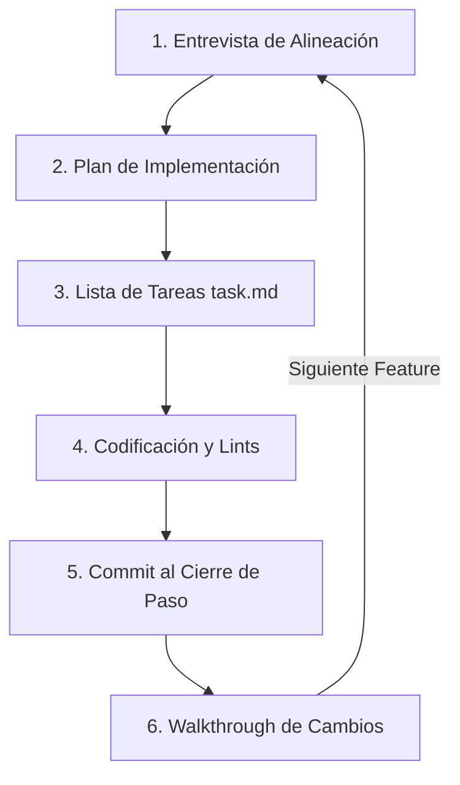

# Metodología de Desarrollo Incremental con Agentes de IA

Este documento describe el flujo de trabajo (workflow) sugerido en este proyecto. Ha sido diseñado para maximizar la sinergia entre desarrolladores humanos y agentes de inteligencia artificial (IA), asegurando un código limpio, estructurado y sin pérdida de contexto entre sesiones.

---

## 🔄 El Ciclo de Desarrollo por Pasos (Iterativo)

Para cada funcionalidad (feature) o fase de desarrollo, el workflow sigue estos 6 pasos estrictos:

### 1. Entrevista de Alineación
Antes de escribir cualquier línea de código, se realiza una sesión corta de preguntas y respuestas de opción múltiple para definir:
* El alcance del módulo.
* La persistencia de datos (mock, localStorage o base de datos).
* La estética del diseño (glassmorphic, minimalista, etc.).

### 2. Creación del Plan de Implementación (`implementation_plan.md`)
El agente de IA genera un artefacto llamado `implementation_plan.md` que detalla:
* Los archivos nuevos (`[NEW]`), modificados (`[MODIFY]`) y borrados (`[DELETE]`).
* Preguntas abiertas.
* El plan de verificación manual y automatizado.
* **El desarrollador humano debe dar su aprobación ("Proceed/Approve") antes de comenzar a codificar.**

### 3. Registro en la Lista de Tareas (`task.md`)
Se mantiene una lista de tareas de seguimiento rápido en un archivo temporal o en el espacio de trabajo:
* `[ ]` Tarea pendiente.
* `[/]` Tarea en progreso.
* `[x]` Tarea completada.

### 4. Codificación Limpia y Corrección de Lints
Durante el desarrollo, se corren validaciones estrictas:
* **TypeScript Estricto:** Cero variables `any` implícitas, control estricto de accesos por índice mediante fallbacks (`??`).
* **Biome Linter:**
  * No usar template literals (backticks) en textos estáticos sin variables.
  * No utilizar el índice (`idx`) de un array como la prop `key` en listas de React (usar identificadores compuestos únicos como `${m.sender}-${m.date}`).

### 5. Commit Automático al Cierre de Paso
Una vez completados los puntos de la lista de tareas de la fase, el agente realiza el commit de manera automática:
* Ej: `feat: agregar panel de envíos y reclamos (Fase 3)`.
* Esto mantiene un historial de git limpio y atomizado por funcionalidad.

### 6. Documentación del Paso (`walkthrough.md`)
Se sugiere al agente actualizar o crear el archivo `walkthrough.md` en el directorio de la conversación para resumir qué se modificó y cómo verificarlo.

---

## 🧠 Transferencia de Contexto entre IAs

Para que otra IA pueda retomar el proyecto sin perder "memoria", la documentación del proyecto debe actualizarse siempre al cerrar un paso:
1. **`docs/roadmap.md`:** Actualizar el estado de la fase (`[COMPLETADO]`).
2. **`docs/decisions.md`:** Agregar las nuevas decisiones técnicas tomadas (ADR - Architecture Decision Records) documentando el *Qué* y el *Por qué*.
3. **`docs/architecture.md`:** Actualizar el mapa del árbol de carpetas si se agregaron nuevos módulos o endpoints.
